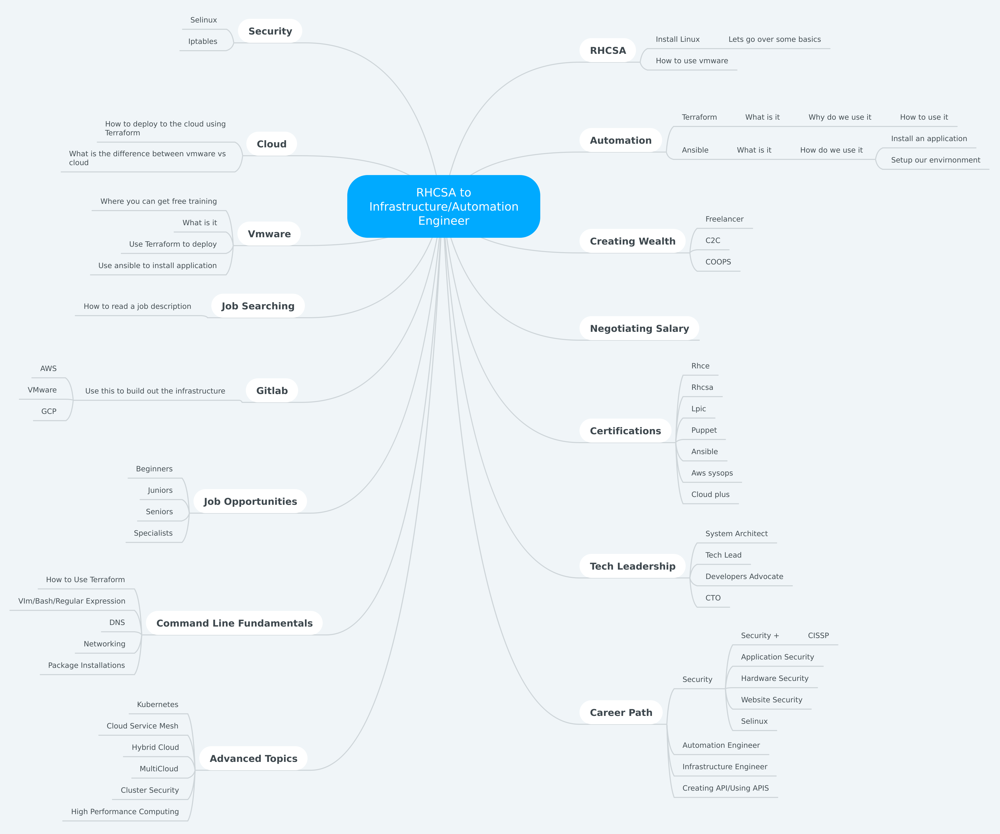

# RHCSA to Infrastructure Engineer


From RHCSA to Infrastructure Engineer. We ofter hear about system administration, scripting/coding, monitoring, automation, cloud, and security. Have you ever asked yourself how do they all intertwine together? Where can I get those skills? If I am in the field, how do I pivot?

## Training
Join BWISE and Women In Linux to begin this journey. In this session, we will perform a live training reviewing the following:
1.	RedHat Certified System Administrator (Training)
```
   a. Setup environment
   b. Install OS (manual install)
   c. Breakdown of filesystem
   d. Command line tools
   e. Linux security
```
2.	Automation of Infrastructure (Training)
```
  a. Ansible
  ```
     - What it is and how it is used
     - Set up and install Ansible
     - Test environment
     - Describe adhoc commands vs playbooks
     - Make an adhoc command
     - Make a playbook
     - Show and understand ansible-galaxy
     - Explain roles (advanced topic)
  ```
  b. Terraform
  ```
     - Differences between Terraform and Ansible
     - Use Terraform documentation
     - Explain directory layout
     - Create a tf-files and deploy infrastructure
  ```
  c. Cloud Deployment
     - Oracle Cloud
     - Google Cloud
     - Digital Ocean
```
## Creating Wealth

3.	Career Path
```
  a. Beginner
  b. Junior
  c. Senior
  d. Specialist
  e. Other options (Security, SRE, Chaos Engineering)
```
## How to get the bag
4.	Interview Questions and techniques
```
   a. How to interact with recuriters
   b. How to sell yourself before they call you
   c. Sponsorship vs Mentorship
   d. Are you really that good?
 ```
 [How one obtained 300k salary](https://blog.usejournal.com/how-i-negotiated-a-software-engineer-offer-in-silicon-valley-f11590f5c6560)

## What to look for
5.  Job Searching
```
  a. How to read a job description
  b. Learn how to set up your own study environments
  c. Which job boards tell the truth
  d. Reading reports and case studies
```

## Requirements
Please note, this workshop is designed for all levels from beginner to intermediate. There will be some advanced content covered. We will provide the environment, but you will need a laptop with a terminal and web browser.

You will need a GitLab account which you can open before or during the training. Go to [www.gitlab.com](https://www.gitlab.com) to create an account.

[Slides](https://womenininux-my.sharepoint.com/:p:/g/personal/tameika74_womeninlinux_com/EXhDR7jGin1NnC-u5VC2fQ8Bq33Vz_InucOwujjexviprQ?e=eNHOEw)

You will also need AWS(Amazon Web Services) and GCP(Google CloudPlatform) accounts.

## Resources

### Linux
- [RHCSA Study Guide](https://github.com/RexDjere/RHCSA)
- [RHCSA BOOK](https://www.amazon.com/RHCSA-Linux-Certification-Study-Seventh/dp/0071841962/ref=pd_lpo_sbs_14_t_0?_encoding=UTF8&psc=1&refRID=B2J267N730EGT0X2BW8B)
- [Linux Foundation](https://www.linuxfoundation.org/)

### CLOUD TRAINING
- [Linux Academy](https://linuxacademy.com/)
- [CloudAcademy](https://cloudacademy.com/)
- [QWIKLABS](https://www.qwiklabs.com/home?locale=en)
- [Free Azure Training](https://www.pluralsight.com/partners/microsoft/azure)

### SRE
- [SRE](https://www.amazon.com/Site-Reliability-Engineering-Production-Systems/dp/149192912X/ref=sr_1_3?s=books&ie=UTF8&qid=1549076294&sr=1-3&keywords=SRE)
- [SEEKING SRE](https://www.amazon.com/Seeking-SRE-Conversations-Running-Production/dp/1491978864/ref=sr_1_5?s=books&ie=UTF8&qid=1549076294&sr=1-5&keywords=SRE)
- [SRE WORKBOOK](https://www.amazon.com/Site-Reliability-Workbook-Practical-Implement/dp/1492029505/ref=sr_1_4?s=books&ie=UTF8&qid=1549076294&sr=1-4&keywords=SRE)
- [SRE VIDEO FROM GOTO CONFERENCE](https://youtu.be/Cxb7a8lTv8A)

### HASHICORP
- [Learn Hashicorp Services](https://learn.hashicorp.com/)

### KUBERNETES
- [Kubernetes Documentation](https://kubernetes.io/)
- [Kubernetes The Hard Way](https://github.com/kelseyhightower/kubernetes-the-hard-way)

### Diverse Platforms
- [Udacity](https://www.udacity.com/)
- [PluralSight](https://www.pluralsight.com/)
- [Coursera](https://www.coursera.org/)
- [EDX](https://www.edx.org/)

### Cyber Security
- [Free Training for Women](https://www.linkedin.com/pulse/free-cybersecurity-training-women-please-share-deidre-diamond/)
- [Cybrary](https://www.cybrary.it/)

### YouTube We Follow
- [HashiCorp](https://www.youtube.com/channel/UC-AdvAxaagE9W2f0webyNUQ/featured)
- [CNCF](https://www.youtube.com/channel/UCvqbFHwN-nwalWPjPUKpvTA)
- [GOOGLE CLOUD PLATFORM](https://www.youtube.com/channel/UCJS9pqu9BzkAMNTmzNMNhvg)
- [FREECODECAMP](https://www.youtube.com/channel/UC8butISFwT-Wl7EV0hUK0BQ/videos)

## MindMap of Dicussion
This mindmap cover the topics discussed. 
- [Link to mind map](https://mm.tt/1210997092?t=8LWdNA8Dnc)


